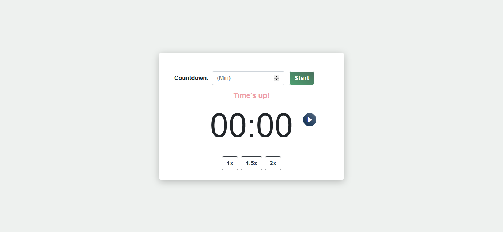

## WaystoCap Challenge Project

A countdown timer , built with React. Try a working demo [here](https://smiletondi.github.io/ways2cap-timer/ )

## Features

* The user is able to enter a # of minutes (positive integer) and click a “Start”
button to initialize the countdown.
* Timer format: MM:SS
* The user is able to pause & resume the countdown using pause/resume
buttons.
* While the countdown timer is active, the user is able to speed up / slow down the
speed at the following rates:
    * 1.0X (normal speed, selected by default)
    * 1.5X
    * 2X
* When half of the selected duration has been passed, display a string of text above the
countdown timer reading: “More than halfway there!”.
    * When the countdown timer reaches 0, this text should change to: “Time’s up!”
* When the countdown is within 20 seconds of ending, the countdown timer text
turn red.
* At 10 seconds, the text start blinking.

## Project Screenshot

## Installation 

### Prerequisites

An active internet connection is required to import CDNs.

###  Setup Instructions

Clone down this repository or download it.
Open up your terminal and type the following commands:

Installation:

`npm install`  

To Start the Servers:

`npm start`  

To Visit the App:

`localhost:3000`  

## Reflection

This was a project built during my application at WaystoCap. Project goals included using technologies i wanted and familiarizing myself with documentation for new features.  

I started the building process by using the `create-react-app` boilerplate, then adding the `Bootstrap` framework to not focus my efforts on `CSS`.  

Due to the time constraints, the code is not "very clean" and you can find some typos in the code.

## Built With

* [React](https://reactjs.org/)
* [Bootstrap](https://getbootstrap.com/)
* [gh-pages](https://pages.github.com/)

## Authors

* **Tondi Ismael** - *Initial work* - [smiletondi](https://github.com/smiletondi)